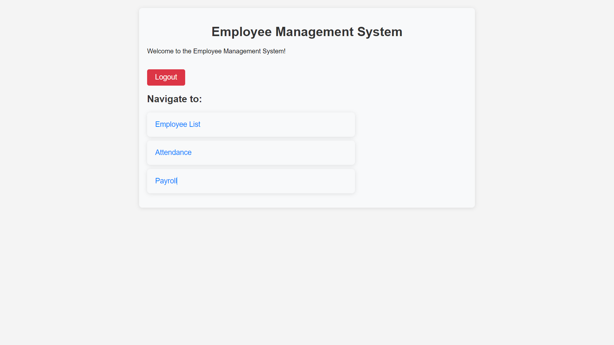
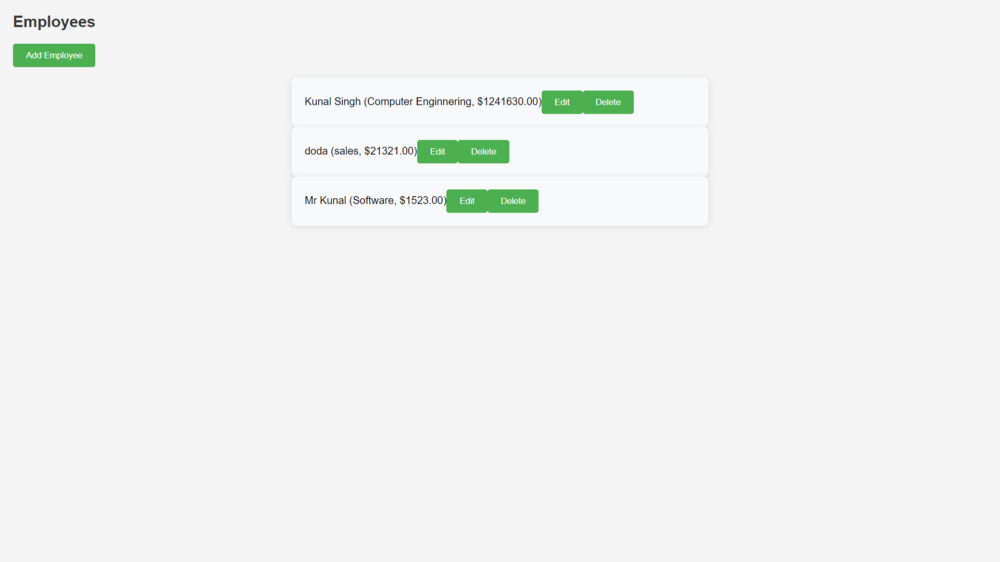

# Employee Management System

An Employee Management System built using Django for the backend and React for the frontend. The system allows an admin to manage employees, track attendance, and handle payrolls efficiently.

## Features

- **Employee Management**: Add, edit, and delete employee details.
- **Attendance Management**: Record attendance for employees.
- **Payroll Management**: Manage employee payrolls with salary and payment details.
- **Authentication**: Admin login to secure access to all functionalities.

## Tech Stack

### Frontend:
- React.js
- Axios (for API requests)
- CSS (for styling)
- Deployed on **Netlify**

### Backend:
- Django (Python Web Framework)
- Django REST Framework (API)
- PostgreSQL (Database)
- Deployed on **Render**

## Prerequisites

- Python 3.x
- Node.js (for React)
- PostgreSQL (for backend database)

## Backend Deployed on render
  [https://employee-management-system-backend-7rjr.onrender.com/api](https://employee-management-system-backend-7rjr.onrender.com/api)
## Frontend Deployed on Netlify
  [https://employee-management-kunal.netlify.app/](https://employee-management-kunal.netlify.app/)

## Screenshots

